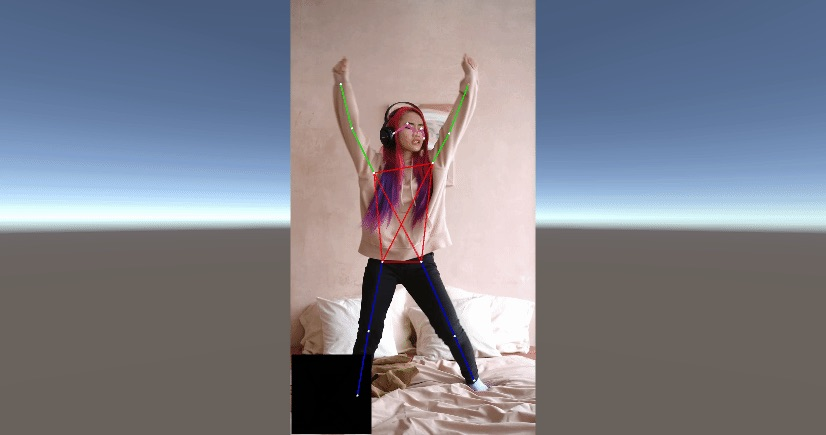

## Unity: From Newbie to Amateur

> This project was developed in Unity 2019.4 and Barracuda 1.0.4. It is recommended one would use the same versions of Unity and Barracuda.

### Goal of the project

The goal of the project is to render 2D human pose estimation keypoints on a video in Unity.

We should be able to see an output running like so below:

### Step 1. Learning from scratch

There are several unknown pieces that are unfamiliar to me:

-  C#
-  Unity

Oftentimes when starting with a completely new technology (in this case: C# & Unity) instead of directly going through the specific tutorial, it's best to go over the most basic foundational knowledge. This will prevent unnecessary back-and-forth between absence of knowledge and learning, and reduce frustration during learning process.

Here are the resources I used below.
C#:

-  [C# Tutorial Video](https://www.youtube.com/watch?v=GhQdlIFylQ8)

Unity:

-  Go through the basic Unity's project tutorial [Lego Micrograme](https://learn.unity.com/project/lego-template), understand the basics of Unity's IDE.
-  [Unity in 2 hours video](https://www.youtube.com/watch?v=pwZpJzpE2lQ)

Along the way read the most important concepts in the Working in Unity, Graphics, Video Overview sections from the [Unity's Manual](https://docs.unity3d.com/Manual/UnityOverview.html).

### Step 2. Going through the Tutorial

Go through the Christian Mills tutorial. Steps are very well presented and easily understood, however there is lots of knowledge missing due to gaps in understanding Unity & C#, therefore I tried to refer back to Step 1 whenever.

### Step 3. Debugging and problem solving the tutorial

I faced quite a few small bugs along the way.
There was one annoying bug that took me more than half a day to figure out. The problem was that the keypoints were not updating position, I debugged (logged variables, used debugger & rendered processed input image) and found that the input image wasn't correct which turned out that shaders weren't running correctly. At the end of the day, it turned out that one has to use exact version of Unity as of tutorial's in order to make sure everything worked correctly.

### Step 4. New model integration

I used original pytorch implementation of [HRNet](https://github.com/leoxiaobin/deep-high-resolution-net.pytorch).

-  I converted the model to onnx format with torch.onnx
-  I modified the single-person keypoint extraction
-  I changed the image pre-processing to be zero mean and standard deviation of one in a shader

### Step 5. Temporal smoothing

There are several problems with temporal tracking of keypoints:

1. Keypoints are missed (e.g. due to low confidence)
2. Keypoints are of wrong location

I solve the first problem by extrapolating the missing keypoint from previous frame's keypoint location and velocity.

## Results

The qualitative results of pose estimation significantly improved with HRNet in comparison to PoseNet.

## Future Improvements

1. **Multi-person**: Use PAFs idea from [CMU-Pose](https://arxiv.org/abs/1611.08050) in order to generalize to multi-person.
2. **Better backbone**: replace either full backbone or some modules from architectures like [HigherHRNet](https://arxiv.org/abs/1908.10357), [EfficientNetV2](https://arxiv.org/pdf/2104.00298.pdf) for better latency-accuracy tradeoff.
3. **Better temporal modelling**: Introduce another module (or separate model) that models temporal relationships end-to-end. It can be sequence-based model (LSTM / Transformer) or 3D CNN.
4. **Better tracking**: Use simple tracking ideas (like Kalman Filter in [SORT](https://github.com/abewley/sort)) in order to smooth predictions across time and match identities.
